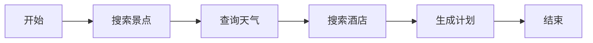

# LangGraph 框架迁移指南

## 概述

本项目已从 `hello-agents` 框架迁移到 **LangGraph** 框架。LangGraph 是一个基于状态图的工作流编排框架，更适合复杂的多步骤 AI 应用。

## 主要变化

### 1. 依赖更新

**原依赖：**
- `hello-agents[protocols]>=0.2.4`

**新依赖：**
- `langgraph>=0.2.0`
- `langchain>=0.3.0`
- `langchain-openai>=0.2.0`
- `langchain-community>=0.3.0`

### 2. 架构变化

#### 原架构（hello-agents）
```
MultiAgentTripPlanner
├── attraction_agent (SimpleAgent)
├── weather_agent (SimpleAgent)
├── hotel_agent (SimpleAgent)
└── planner_agent (SimpleAgent)
```

每个 Agent 独立运行，通过顺序调用协作。

#### 新架构（LangGraph）
```
StateGraph Workflow
├── search_attractions_node
├── query_weather_node
├── search_hotels_node
└── plan_trip_node
```

使用状态图管理工作流，节点之间通过状态传递数据。

### 3. 文件结构

新增文件：
- `backend/app/agents/graph_state.py` - 状态定义
- `backend/app/agents/graph_nodes.py` - 节点函数
- `backend/app/agents/trip_planner_agent_langgraph.py` - LangGraph 主类

保留文件（可选）：
- `backend/app/agents/trip_planner_agent.py` - 原 hello-agents 版本（备份）

### 4. 工作流程

#### LangGraph 工作流


**状态传递：**
1. `search_attractions_node` → 景点数据 → `attractions_data`
2. `query_weather_node` → 天气数据 → `weather_data`
3. `search_hotels_node` → 酒店数据 → `hotel_data`
4. `plan_trip_node` → 最终计划 → `final_plan`

### 5. API 变化

API 端点保持不变，但内部实现改为使用 LangGraph：

```python
# backend/app/api/routes/trip.py
from ...agents.trip_planner_agent_langgraph import get_trip_planner_agent
```

## 安装步骤

### 1. 安装新依赖

```bash
cd backend
pip install -r requirements.txt
```

或单独安装：
```bash
pip install langgraph langchain langchain-openai langchain-community
```

### 2. 环境变量配置

确保 `.env` 文件包含以下配置：

```env
# OpenAI API 配置
OPENAI_API_KEY=your_api_key
OPENAI_BASE_URL=https://api.openai.com/v1
OPENAI_MODEL=gpt-4

# 高德地图 API
AMAP_API_KEY=your_amap_key
```

### 3. 运行项目

```bash
cd backend
python run.py
```

## 代码示例

### 使用 LangGraph 规划器

```python
from app.agents.trip_planner_agent_langgraph import get_trip_planner_agent
from app.models.schemas import TripRequest

# 获取规划器实例
planner = get_trip_planner_agent()

# 创建请求
request = TripRequest(
    city="北京",
    start_date="2024-06-01",
    end_date="2024-06-03",
    travel_days=3,
    preferences=["历史文化", "美食"],
    transportation="公共交通",
    accommodation="经济型酒店"
)

# 生成计划
trip_plan = planner.plan_trip(request)
```

### 自定义节点

如需添加新节点，在 `graph_nodes.py` 中定义：

```python
def custom_node(state: TripPlannerState) -> Dict[str, Any]:
    """自定义节点"""
    print("🔧 执行自定义逻辑...")
    
    # 处理逻辑
    result = do_something(state)
    
    return {
        "custom_data": result,
        "current_step": "custom_completed"
    }
```

然后在 `trip_planner_agent_langgraph.py` 中添加到工作流：

```python
# 添加节点
workflow.add_node("custom", custom_node)

# 添加边
workflow.add_edge("search_hotels", "custom")
workflow.add_edge("custom", "plan_trip")
```

## LangGraph 优势

### 1. 可视化工作流
LangGraph 提供图结构，清晰展示各步骤关系。

### 2. 状态管理
统一的状态对象，避免数据传递混乱。

### 3. 条件路由
支持基于状态的条件分支：

```python
def should_retry(state):
    return "retry" if state.get("error") else "continue"

workflow.add_conditional_edges(
    "plan_trip",
    should_retry,
    {
        "retry": "search_attractions",
        "continue": END
    }
)
```

### 4. 并行执行
支持节点并行运行：

```python
# 并行执行景点、天气、酒店搜索
workflow.add_edge(START, ["search_attractions", "query_weather", "search_hotels"])
workflow.add_edge(["search_attractions", "query_weather", "search_hotels"], "plan_trip")
```

### 5. 检查点和回溯
支持保存中间状态，失败时可恢复。

## 与 hello-agents 对比

| 特性 | hello-agents | LangGraph |
|------|-------------|-----------|
| 学习曲线 | 简单 | 中等 |
| 工作流可视化 | ❌ | ✅ |
| 状态管理 | 手动传递 | 自动管理 |
| 条件路由 | 需自己实现 | 内置支持 |
| 并行执行 | 困难 | 简单 |
| 社区支持 | 较小 | 大（LangChain 生态）|
| 适用场景 | 简单 Agent | 复杂工作流 |

## 性能优化建议

### 1. 并行执行独立节点
如果景点、天气、酒店搜索互不依赖，可以并行执行：

```python
from langgraph.graph import START

workflow.add_edge(START, "search_attractions")
workflow.add_edge(START, "query_weather")
workflow.add_edge(START, "search_hotels")
```

### 2. 添加缓存
对重复查询进行缓存：

```python
from langchain.cache import InMemoryCache
import langchain
langchain.llm_cache = InMemoryCache()
```

### 3. 流式输出
使用 `stream()` 方法获取中间结果：

```python
for state in planner.app.stream(initial_state):
    print(f"当前步骤: {state.get('current_step')}")
```

## 故障排查

### 问题 1: 导入错误
```
ModuleNotFoundError: No module named 'langgraph'
```
**解决：** `pip install langgraph langchain langchain-openai`

### 问题 2: OpenAI API 配置
```
openai.error.AuthenticationError
```
**解决：** 检查 `.env` 中的 `OPENAI_API_KEY` 是否正确

### 问题 3: 状态类型错误
```
TypeError: 'NoneType' object is not subscriptable
```
**解决：** 确保所有节点返回正确的字典结构

## 回退到 hello-agents

如需回退到原版本：

1. 恢复 `requirements.txt`:
```bash
git checkout backend/requirements.txt
```

2. 修改 API 路由:
```python
# backend/app/api/routes/trip.py
from ...agents.trip_planner_agent import get_trip_planner_agent
```

3. 重新安装依赖:
```bash
pip install -r requirements.txt
```

## 进一步学习

- [LangGraph 官方文档](https://langchain-ai.github.io/langgraph/)
- [LangChain 教程](https://python.langchain.com/)
- [示例项目](https://github.com/langchain-ai/langgraph/tree/main/examples)

## 支持

如有问题，请查看：
1. 项目 README.md
2. LangGraph 官方文档
3. 提交 Issue
