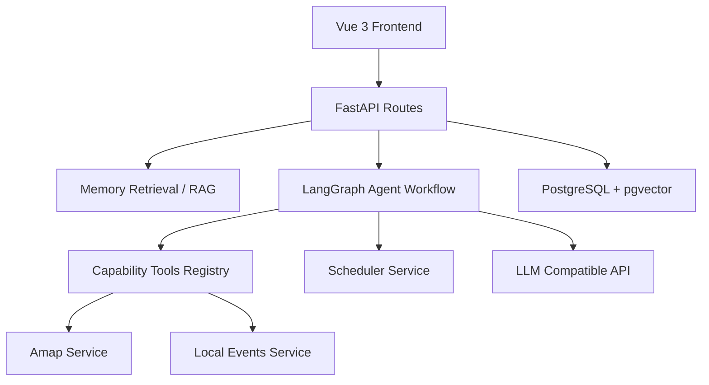
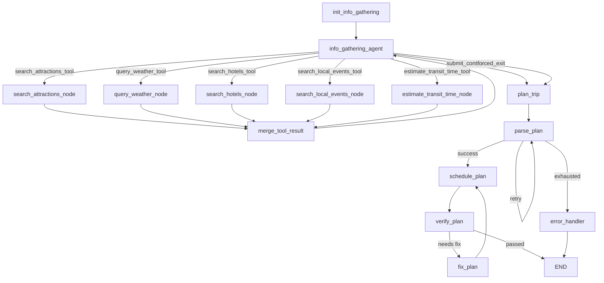

# 智能旅行助手项目介绍（功能、架构与 Pipeline）

## 1. 项目定位

本项目是一个面向智能旅行规划的 Agent 应用，目标是把“用户需求 -> 信息收集 -> 行程生成 -> 自动排程 -> 校验修复 -> 编辑回写 -> 偏好沉淀”做成可维护的工程闭环。

它不是单次让大模型直接生成文本，而是通过 LangGraph 把 LLM 决策、工具调用、结构化状态、规则排程、RAG 记忆和持久化版本管理组合起来。

核心目标：

- 生成可展示、可编辑、可保存的多日旅行计划。
- 用真实工具结果支撑天气、景点、酒店和交通判断，避免模型编造基础信息。
- 用历史记忆和用户编辑反馈持续改善个性化体验。
- 通过确定性校验和修复回环降低不可执行行程的风险。

## 2. 当前完成度

当前主链路已经完成以下改造：

- 信息收集阶段已扩展运行态 state，包括 `sop_required`、`sop_completed`、`gathered_context`、`tool_call_history`、`candidate_filter_notes`、`ready_for_planning`。
- `info_gathering_agent_node` 已成为信息收集决策 agent：可用 LLM 决策下一步工具，也有规则兜底和 sanitize 防护。
- 天气、景点、酒店、本地活动、交通时间均已封装为 `@tool + Pydantic` 工具，并注册到 `CAPABILITY_TOOLS`。
- 工具节点已收敛为 executor / graph adapter：只负责组装输入、调用 registry、写回 state，不再自行扮演 agent。
- `search_local_events_tool` 作为“惊喜感创造工具”，只在兴趣或慢节奏信号触发时作为可选增强，不进入必过 SOP。
- `estimate_transit_time_tool` 已接入，用于生成交通证据和候选过滤说明。
- Planner 只优先消费非冲突 local events 和未被交通证据剔除的候选，不让可选活动覆盖基础景点主线。

最近一次完整回归：

```text
python -m unittest discover backend -p "test_*.py"

Ran 33 tests
OK
```

## 3. 系统分层



职责边界：

- 前端层：收集旅行需求、展示地图和行程、支持编辑保存。
- API 层：校验请求、调用记忆检索、启动 LangGraph、保存计划和版本。
- Agent 编排层：控制信息收集、规划、解析、排程、校验、修复。
- Tool 能力层：用统一 schema 暴露可调用能力，返回模型和图层都能消费的结果。
- Service 层：封装真实数据源和确定性逻辑，例如高德地图、活动候选、排程、记忆。
- 数据层：保存计划、版本、记忆和向量。

## 4. 四 Agent 职责

当前系统按“四 Agent 思路”收敛，但只有前三个进入主链路：

- 信息收集决策 agent：`info_gathering_agent_node`。决定下一步调用哪个工具，禁止跳过必过 SOP。
- 行程生成 agent：`plan_trip_node`。读取整理后的上下文，生成原始行程 JSON。
- 计划修复 agent：`fix_plan_node`。在校验失败时做局部修复，之后重新排程和复验。
- 可选质量评估 agent：`judge_trip_plan`。位于 `backend/app/services/judge.py`，用于离线质量评估，暂不进入用户请求主链路。

## 5. LangGraph 主流程



信息收集循环的关键点：

- 每次工具节点执行后回到 `merge_tool_result`，再回到 `info_gathering_agent_node` 做下一步决策。
- LLM 决策只决定 `action/tool_name/reasoning_summary/ready_for_planning`。
- 工具输入不采信 LLM 输出，由 `_tool_input_for_step(...)` 从 state 重建。
- sanitize 会阻止非法工具、跳过必查项、提前提交、用 local events 替代景点等情况。
- LLM 失败或返回坏 JSON 时，自动回退到规则版决策。

## 6. 信息收集 SOP

必过或条件必过：

- `search_attractions_tool`：基础景点候选，必须执行。
- `query_weather_tool`：天气上下文，必须执行。
- `search_hotels_tool`：当请求需要住宿时执行。
- `estimate_transit_time_tool`：当交通风险、固定时间活动或候选分布需要判断时执行。

可选增强：

- `search_local_events_tool`：按兴趣或慢节奏信号触发，提供展览、演出、亲子、音乐等惊喜候选。

`local_events` 不影响 `all_required_sop_completed`，不会阻塞进入规划。

## 7. Tool Registry 与能力封装

统一注册入口：

```python
CAPABILITY_TOOLS = {
    "estimate_transit_time_tool": estimate_transit_time_tool,
    "query_weather_tool": query_weather_tool,
    "search_attractions_tool": search_attractions_tool,
    "search_hotels_tool": search_hotels_tool,
    "search_local_events_tool": search_local_events_tool,
}
```

通用封装流程：

1. Service 层提供真实数据或确定性能力，不直接读写 graph state。
2. Tool 层用 Pydantic 定义输入 schema，用 `@tool(args_schema=...)` 暴露能力。
3. Tool docstring 写清使用时机、输入约束、行为限制和输出语义。
4. Tool 返回统一结构，通常包含 `text`、`items`、`warning`、`meta`。
5. Registry 注册 graph 内部工具名到 tool 对象。
6. Graph adapter 从 state 构造输入，通过 registry 调用 tool，再写回 `gathered_context`、`tool_call_history`、`context_summary`。
7. Planner prompt 只消费整理后的上下文，不直接调用底层 service。

## 8. 当前工具清单

| 工具 | 输入 Schema | 主要写回 | 说明 |
| --- | --- | --- | --- |
| `search_attractions_tool` | `SearchAttractionsInput` | `gathered_context["attractions"]` | 基础景点候选，真实高德 POI，必过 |
| `query_weather_tool` | `QueryWeatherInput` | `gathered_context["weather"]` | 真实天气上下文，必过 |
| `search_hotels_tool` | `SearchHotelsInput` | `gathered_context["hotels"]` | 住宿候选，按请求条件必过 |
| `search_local_events_tool` | `SearchLocalEventsInput` | `gathered_context["local_events"]` | 可选惊喜候选，不进必过 SOP |
| `estimate_transit_time_tool` | `EstimateTransitTimeInput` | `gathered_context["transit_evidence"]` | 交通证据，服务候选过滤和可执行性判断 |

## 9. State 与上下文工程

核心 state 位于 `backend/app/agents/graph_state.py`。

会进入 planner prompt 的主要上下文：

- 原始请求：城市、日期、天数、交通、住宿、预算、每日时间窗、兴趣和自由文本。
- `inferred_preferences` / `memory_summary`：RAG 召回后的历史偏好摘要。
- `gathered_context["attractions"]`：景点候选。
- `gathered_context["weather"]`：天气信息。
- `gathered_context["hotels"]`：酒店候选。
- `gathered_context["local_events"]`：可选本地活动，优先非 `conflicting` 项。
- `gathered_context["transit_evidence"]`：交通耗时和候选剔除证据。
- `candidate_filter_notes`：候选过滤原因说明。
- 硬约束块：预算、每日时段、最大景点数、休息时间、住宿限制等。

这些上下文先由工具和规则层整理成结构化 state，再由 planner 消费，避免把底层 service 的原始返回直接塞给模型。

## 10. RAG 记忆链路

记忆写入来源：

- 首次规划请求提炼出的偏好、限制和习惯。
- 用户编辑后的差异，例如删除某类景点、调整节奏、偏好某类住宿。

检索与注入流程：

1. API 层根据当前请求构造 query text。
2. `memory_service` 生成 embedding 并在 pgvector 中检索相关记忆。
3. 若向量检索为空，回退到最近记忆。
4. 命中记忆被汇总为 `inferred_preferences`。
5. 信息收集决策和行程生成 prompt 都可以读取该摘要。

## 11. API 与持久化

核心接口：

- `POST /api/trip/plan`：生成并保存行程。
- `POST /api/trip/plan/stream`：通过 SSE 返回生成进度和最终计划。
- `GET /api/trip/plans/{plan_id}`：读取已保存计划。
- `PUT /api/trip/plans/{plan_id}`：保存用户编辑后的计划，触发重排和记忆沉淀。
- `GET /api/map/poi` / `GET /api/map/weather` / `POST /api/map/route`：地图服务接口。

持久化层：

- `trip_repository.py`：行程计划和版本记录。
- `memory_repository.py`：用户偏好记忆。
- `persistence_service.py`：持久化辅助能力。

## 12. 配置

常用后端配置：

- `LLM_API_KEY`
- `LLM_BASE_URL`
- `LLM_MODEL`
- `LLM_EMBEDDING_MODEL`
- `JUDGE_MODEL`
- `INFO_GATHERING_USE_LLM`
- `AMAP_API_KEY`
- `DATABASE_URL`
- `RAG_DEBUG`
- `SCHEDULE_USE_MCP_ROUTE`

`INFO_GATHERING_USE_LLM=true` 时启用 LLM 决策；如果 LLM 不可用或输出不合法，会回退到规则决策。

## 13. 测试覆盖

重点测试文件：

- `backend/test_phase1_info_gathering.py`
- `backend/test_local_events_tooling.py`
- `backend/test_phase3_transit_filtering.py`

覆盖内容：

- state 初始化和 SOP 完成判断。
- LLM 决策 sanitize 与规则 fallback。
- registry 返回各工具。
- 天气、景点、酒店工具节点写回 state。
- local events 输入校验、registry 调用和 planner 可选消费。
- transit 工具封装、固定时间活动触发、交通证据过滤。
- local events 不影响必过 SOP。

推荐回归命令：

```bash
python backend/test_phase1_info_gathering.py
python backend/test_local_events_tooling.py
python backend/test_phase3_transit_filtering.py
python -m unittest discover backend -p "test_*.py"
```

## 14. 后续建议

- 将 `CAPABILITY_TOOLS` 的命名在后续迭代中评估是否改为更中性的 `GRAPH_TOOLS`，因为现在它既承载可选能力，也承载基础信息工具。
- 为新增工具补充统一开发文档模板，减少后续能力接入时的重复讨论。
- 优化测试耗时，保持本地回归可快速执行。
- 增加不依赖真实 LLM/API 的端到端 smoke test，覆盖从请求到结构化 state 的主链路。

## 15. 一句话总结

当前项目已经从普通 LLM 旅行规划 Demo 演进为一个以 LangGraph 为编排核心、以工具封装和结构化 state 为上下文工程基础、以 RAG 记忆和校验修复闭环增强质量的智能旅行规划系统。
