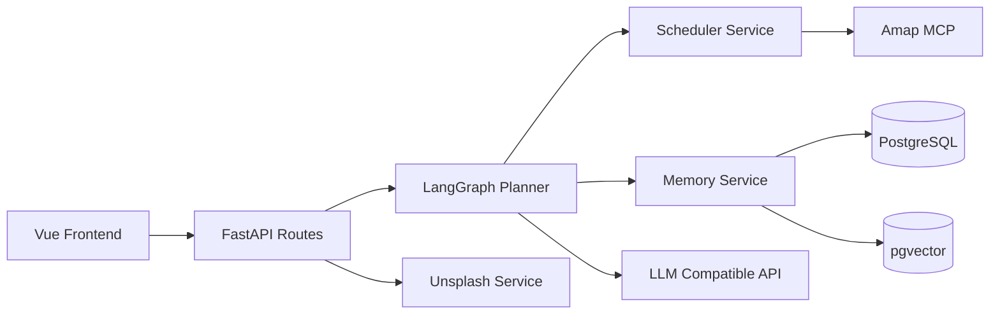
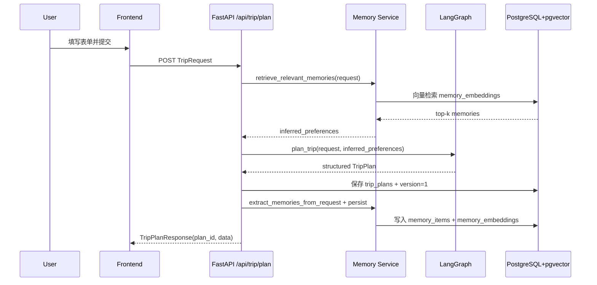

# 智能旅行助手项目介绍（功能、架构与 Pipeline）

## 1. 项目定位
本项目是一个面向单用户场景的智能旅行规划系统，目标是把“需求输入 -> 行程生成 -> 时间排程 -> 编辑回写 -> 偏好沉淀”做成可闭环产品。

核心特点：
- 使用 LangGraph 编排多阶段规划流程（数据收集、生成、解析、校验、修复）。
- 使用 PostgreSQL + pgvector 存储结构化行程和用户记忆（memory），走“数据库 + RAG”路径。
- 支持行程编辑后反向提炼偏好并回写记忆库，让后续推荐更贴近用户习惯。
- 前端提供地图可视化、预算展示、风险提醒、导出图片/PDF。

---

## 2. 功能全景

### 2.1 行程生成能力
- 输入：城市、日期、天数、交通偏好、住宿偏好、兴趣标签、预算、每日时段、额外要求。
- 输出：按天组织的完整行程，包含景点、酒店、餐饮、天气、预算。
- 自动补全：为景点填充建议游览时长、建议时间段（`visit_start_time` / `visit_end_time`）、时间线（`timeline`）。

### 2.2 RAG 记忆增强能力
- 记忆写入来源：
  - 首次规划请求（request）提炼偏好/约束。
  - 用户编辑后的差异（edit）提炼“强偏好信号”。
- 记忆检索：
  - 先对当前请求做 embedding，再在 `memory_embeddings` 做向量相似检索。
  - 若检索为空，回退到最近记忆。
- 检索结果会汇总为 `inferred_preferences`，注入到规划提示词中。

### 2.3 编辑与版本管理
- 前端支持编辑景点顺序、删景点、改地址/描述/时长，保存后回写后端。
- 后端保存新版本，并触发自动重排（schedule）与记忆更新（memory extract + persist）。
- 具备版本表，支持“当前版本 + 历史版本”并存。

### 2.4 地图与图片增强
- 地图：高德 JS API 展示景点 Marker。
- 图片：后端通过 Unsplash 查询景点图，前端失败时自动降级为 SVG 占位图。

### 2.5 观测与日志
- 启动日志打印配置状态。
- `/api/trip*` 请求有统一入口/出口日志。
- 打开 `RAG_DEBUG=True` 可看到 memory 命中与汇总信息。

---

## 3. 技术架构

### 3.1 架构分层
- 前端：Vue3 + TypeScript + Vite + Ant Design Vue。
- API 层：FastAPI（`/api/trip`、`/api/map`、`/api/poi`）。
- Agent 层：LangGraph 工作流（多节点 + 条件边 + 修复回环）。
- 服务层：`amap_service`、`memory_service`、`scheduler_service`、`unsplash_service`。
- 数据层：PostgreSQL（JSONB）+ pgvector（向量列）+ SQLAlchemy。

### 3.2 模块关系图

---

## 4. 数据模型与存储设计

当前核心是 4 张表（单用户场景）：

1. `trip_plans`
- 存当前行程快照（`current_plan_payload`）和原始请求（`request_payload`）。
- 字段包括城市、日期、天数、状态、创建更新时间。

2. `trip_plan_versions`
- 每次生成/编辑保存一个版本快照（`plan_payload`）。
- 通过 `(trip_plan_id, version_no)` 唯一约束形成版本序列。

3. `memory_items`
- 存记忆文本（偏好、习惯、约束、摘要等）和元数据（`metadata`）。
- 可记录来源行程、权重、最后使用时间。

4. `memory_embeddings`
- 存每条记忆的向量（`Vector(1536)`），一对一关联 `memory_items`。
- 用于相似度检索（cosine distance）。

关系说明：
- `trip_plans` 1:N `trip_plan_versions`
- `trip_plans` 1:N `memory_items`（可空关联）
- `memory_items` 1:1 `memory_embeddings`

---

## 5. 端到端 Pipeline（生成链路）

### 5.1 时序概览

### 5.2 LangGraph 内部流程
节点顺序：
1. `search_attractions`
2. `query_weather`
3. `search_hotels`
4. `plan_trip`（生成原始文本）
5. `parse_plan`（解析 JSON）
6. `schedule_plan`（补齐时间线）
7. `verify_plan`（规则校验）
8. `fix_plan`（必要时修复后回到 parse）
9. `error_handler`（异常出口）

关键控制策略：
- `parse_plan` 最多重试 3 次，超限进入 `error_handler`。
- `verify_plan` 根据问题严重级别和可修复性决定是否进 `fix_plan`。
- 修复次数有限制，避免无限循环。

---

## 6. 编辑回写 Pipeline（闭环学习）

当用户在结果页编辑并保存时：

1. 前端 `PUT /api/trip/plans/{plan_id}` 提交完整 `TripPlan`。
2. 后端自动执行 `schedule_day_plan`，重建 `timeline`、时长、成本，并追加 warning。
3. 保存新版本（`trip_plan_versions` + 更新 `trip_plans.current_plan_payload`）。
4. 用“编辑前后差异”提炼 2-3 条强记忆（如偏自然/偏文化、节奏松紧、住宿偏移）。
5. 写入 `memory_items` + `memory_embeddings`，用于下次生成召回。

---

## 7. RAG 实现细节（当前版本）

### 7.1 Embedding 生成策略
- 首选：`OpenAIEmbeddings`（模型来自 `openai_embedding_model`）。
- 回退：若 embedding API 不可用，使用 `_hash_embedding` 生成稳定伪向量，保证流程不断。

### 7.2 检索策略
- Query 向量来自 `build_request_query_text(request)`。
- 检索范围类型：`preference/dislike/habit/constraint/summary`。
- 排序方式：`cosine_distance`（越近越相关），取 top-k。
- 回退策略：向量检索为空则取最近记忆。

### 7.3 汇总策略
- 将命中记忆去重后拼成最多 4 条 bullet，形成 `inferred_preferences`。
- 该摘要作为“历史偏好上下文”注入主规划提示词。

说明：
- `weight` 字段当前主要用于写入侧强度表达与筛选，不直接参与 SQL 向量排序。

---

## 8. API 概览

核心接口：
- `POST /api/trip/plan`：生成并持久化行程（含 RAG 检索）。
- `GET /api/trip/plans/{plan_id}`：读取已保存行程。
- `PUT /api/trip/plans/{plan_id}`：更新行程、自动重排、写入编辑记忆。
- `GET /api/map/poi` / `GET /api/map/weather` / `POST /api/map/route`：地图相关服务。
- `GET /api/poi/photo`：景点图片查询。

---

## 9. 配置与运行

后端关键配置（`backend/.env`）：
- `OPENAI_API_KEY` / `OPENAI_BASE_URL` / `OPENAI_MODEL`
- `OPENAI_EMBEDDING_MODEL`（例如 `text-embedding-3-small`）
- `DATABASE_URL`（PostgreSQL）
- `AMAP_API_KEY`
- `RAG_DEBUG=True|False`
- `LOG_LEVEL=INFO|DEBUG`

运行方式：
- 后端：`python run.py`（FastAPI + uvicorn reload）
- 前端：`npm run dev`

---

## 10. 现状边界与后续扩展

当前边界：
- 单用户记忆池（未做 `user_id` 维度隔离）。
- LLM 生成结果质量依赖模型与提示词，仍需校验修复链路兜底。

推荐下一步：
1. 增加 `user_id` 和画像表，实现多用户隔离与个性化检索。
2. 为 RAG 引入“向量分 + 时间衰减 + 业务权重”的综合排序。
3. 将排程器抽成独立 MCP 工具，支持更强的可解释重排。
4. 引入数据库迁移脚本（Alembic）统一建表和版本演进。
5. 增加端到端测试（生成、编辑、RAG 命中、时间线一致性）。

---

## 11. 一句话总结
这是一个以 LangGraph 为核心编排、以 PostgreSQL+pgvector 为记忆底座、以“生成-编辑-学习”闭环驱动体验持续提升的智能旅行规划系统。
