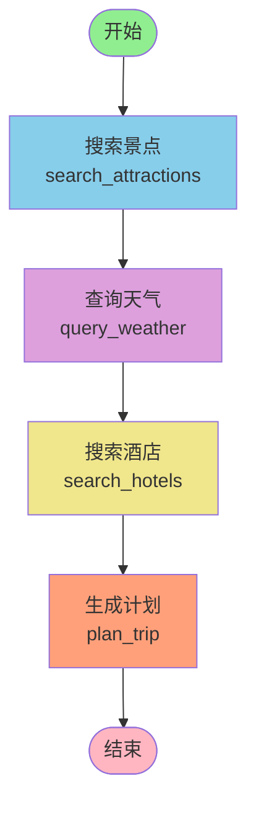

# LangGraph 智能旅行助手 🌍✈️

基于 **LangGraph** 框架构建的智能旅行规划助手，使用状态图工作流编排多步骤 AI 任务，提供个性化的旅行计划生成。

> **🎉 最新更新**: 已从 `hello-agents` 迁移到 **LangGraph** 框架，获得更强大的工作流编排能力！

## ✨ 功能特点

- 🤖 **LangGraph 工作流**: 基于状态图的智能旅行规划，清晰的步骤编排
- 🔄 **多步骤协作**: 景点搜索 → 天气查询 → 酒店推荐 → 行程规划
- 🧠 **智能 AI 规划**: 使用 LangChain + OpenAI，生成个性化旅行计划
- 📊 **可视化工作流**: 支持生成工作流图表，清晰展示执行流程
- 🎨 **现代化前端**: Vue3 + TypeScript + Vite，响应式设计
- 📱 **完整功能**: 包含住宿、交通、餐饮、景点和预算信息

## 🏗️ 技术栈

### 后端
- **AI 框架**: LangGraph + LangChain
- **LLM**: OpenAI / DeepSeek / 兼容 API
- **API**: FastAPI
- **地图服务**: 高德地图 (可选)

### 前端
- **框架**: Vue 3 + TypeScript
- **构建工具**: Vite
- **UI**: Ant Design Vue
- **地图**: 高德地图 JavaScript API
- **HTTP**: Axios

## 📁 项目结构

```
helloagents-trip-planner/
├── backend/                           # 后端服务
│   ├── app/
│   │   ├── agents/                   # LangGraph Agent
│   │   │   ├── graph_state.py        # 状态定义
│   │   │   ├── graph_nodes.py        # 节点函数
│   │   │   ├── trip_planner_agent_langgraph.py  # 主类
│   │   │   └── trip_planner_agent.py # 原版本(备份)
│   │   ├── api/                      # FastAPI 路由
│   │   │   ├── main.py
│   │   │   └── routes/
│   │   │       ├── trip.py
│   │   │       └── map.py
│   │   ├── services/                 # 服务层
│   │   │   ├── llm_service.py
│   │   │   └── amap_service.py
│   │   ├── models/                   # 数据模型
│   │   │   └── schemas.py
│   │   └── config.py
│   ├── requirements.txt
│   ├── test_langgraph.py             # 测试脚本
│   ├── visualize_workflow.py         # 可视化工具
│   └── upgrade_to_langgraph.py       # 升级脚本
├── frontend/                          # 前端应用
│   ├── src/
│   │   ├── views/
│   │   ├── services/
│   │   └── main.ts
│   └── package.json
├── LANGGRAPH_MIGRATION.md            # 迁移指南
└── README.md
```

## 🚀 快速开始

### 1. 环境准备

**Python 要求**: Python 3.8+

```bash
# 克隆项目
git clone <your-repo-url>
cd helloagents-trip-planner
```

### 2. 后端设置

```bash
cd backend

# 创建虚拟环境 (推荐)
python -m venv venv
source venv/bin/activate  # Windows: venv\Scripts\activate

# 安装依赖
pip install -r requirements.txt

# 配置环境变量
cp .env.example .env
# 编辑 .env 文件，添加必需的 API 密钥
```

**.env 配置示例:**
```env
# OpenAI API 配置
OPENAI_API_KEY=your_openai_api_key
OPENAI_BASE_URL=https://api.openai.com/v1
OPENAI_MODEL=gpt-4

# 高德地图 API (可选)
AMAP_API_KEY=your_amap_key

# 服务配置
HOST=0.0.0.0
PORT=8000
```

### 3. 运行后端

```bash
# 方式 1: 直接运行
python run.py

# 方式 2: 使用 uvicorn
uvicorn app.api.main:app --reload --host 0.0.0.0 --port 8000
```

后端将在 `http://localhost:8000` 启动

- API 文档: http://localhost:8000/docs
- 健康检查: http://localhost:8000/health

### 4. 前端设置

```bash
cd frontend

# 安装依赖
npm install

# 启动开发服务器
npm run dev
```

前端将在 `http://localhost:5173` 启动

## 🧪 测试

### 测试 LangGraph 工作流

```bash
cd backend
python test_langgraph.py
```

### 可视化工作流

```bash
cd backend
python visualize_workflow.py
```

这会生成工作流的可视化图表。

### API 测试

```bash
curl -X POST http://localhost:8000/api/trip/plan \
  -H "Content-Type: application/json" \
  -d '{
    "city": "北京",
    "start_date": "2024-06-01",
    "end_date": "2024-06-03",
    "travel_days": 3,
    "preferences": ["历史文化", "美食"],
    "transportation": "公共交通",
    "accommodation": "经济型酒店"
  }'
```

## 📊 LangGraph 工作流



### 工作流说明

1. **search_attractions**: 根据城市和偏好搜索景点
2. **query_weather**: 查询目的地天气预报
3. **search_hotels**: 搜索推荐酒店
4. **plan_trip**: 整合所有信息生成详细行程

### 状态管理

```python
class TripPlannerState(TypedDict):
    request: TripRequest          # 用户请求
    attractions_data: str         # 景点数据
    weather_data: str            # 天气数据
    hotel_data: str              # 酒店数据
    final_plan: str              # 最终计划
    current_step: str            # 当前步骤
    error: Optional[str]         # 错误信息
```

## 🔧 自定义配置

### 添加新节点

在 `backend/app/agents/graph_nodes.py` 中定义新节点:

```python
def custom_node(state: TripPlannerState) -> Dict[str, Any]:
    """自定义节点"""
    # 处理逻辑
    result = do_something(state)
    return {
        "custom_data": result,
        "current_step": "custom_completed"
    }
```

在 `backend/app/agents/trip_planner_agent_langgraph.py` 中添加到工作流:

```python
workflow.add_node("custom", custom_node)
workflow.add_edge("search_hotels", "custom")
workflow.add_edge("custom", "plan_trip")
```

### 修改 LLM 配置

编辑 `backend/app/agents/graph_nodes.py`:

```python
def create_llm():
    settings = get_settings()
    return ChatOpenAI(
        model=settings.openai_model,
        temperature=0.7,  # 调整创造性
        max_tokens=2000   # 调整输出长度
    )
```

## 📚 文档

- **[迁移指南](LANGGRAPH_MIGRATION.md)**: 从 hello-agents 到 LangGraph 的详细迁移说明
- **[LangGraph 官方文档](https://langchain-ai.github.io/langgraph/)**: LangGraph 框架文档
- **[LangChain 文档](https://python.langchain.com/)**: LangChain 使用指南

## 🆚 框架对比

| 特性 | hello-agents | LangGraph |
|------|-------------|-----------|
| 学习曲线 | 简单 | 中等 |
| 工作流可视化 | ❌ | ✅ |
| 状态管理 | 手动 | 自动 |
| 条件路由 | 需实现 | 内置 |
| 并行执行 | 困难 | 简单 |
| 社区支持 | 小 | 大 |

## 🔄 从 hello-agents 迁移

如果你有旧版本的项目，可以使用升级脚本:

```bash
cd backend
python upgrade_to_langgraph.py
```

或者查看详细的 [迁移指南](LANGGRAPH_MIGRATION.md)。

## 🐛 故障排查

### 问题 1: ModuleNotFoundError: No module named 'langgraph'

**解决:**
```bash
pip install langgraph langchain langchain-openai
```

### 问题 2: OpenAI API 认证失败

**解决:** 检查 `.env` 文件中的 `OPENAI_API_KEY`

### 问题 3: 返回的计划格式不正确

**解决:** 调整 `graph_nodes.py` 中的 `system_prompt`，提供更明确的格式要求

## 🤝 贡献

欢迎提交 Issue 和 Pull Request！

## 📄 许可证

MIT License

## 🙏 致谢

- [LangGraph](https://github.com/langchain-ai/langgraph) - 工作流框架
- [LangChain](https://github.com/langchain-ai/langchain) - LLM 应用框架
- [FastAPI](https://fastapi.tiangolo.com/) - 现代 Web 框架
- [Vue.js](https://vuejs.org/) - 前端框架

---

**更新日期**: 2024-01-10  
**版本**: 2.0.0 (LangGraph)  
**作者**: Your Name
